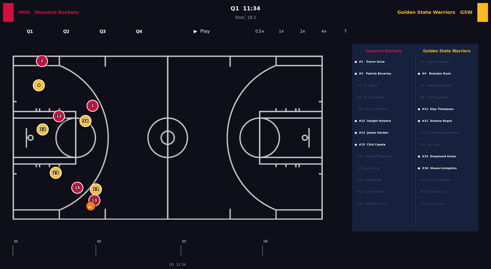
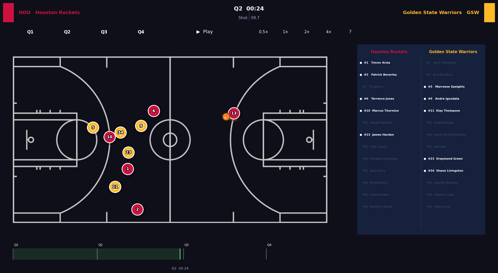

# NBA Tracking Viewer

Interactive desktop tools for watching NBA games and individual possessions from SportVU player-tracking data — smooth animation, scrubable timeline, and real-time roster context.

> Python ≥ 3.8 · matplotlib ≥ 3.4 · pandas ≥ 1.0 · MIT license

---

## Tools

| Script | Input | Use case |
|---|---|---|
| `full_game_main.py` | SportVU JSON | Watch an entire game |
| `possession_viewer.py` | Possession CSV + `player_data.csv` | Inspect a single possession |

---

## Preview

**Q1 — Tip-off**



**Mid-game**



---

## Quick Start (RUN)

### Full Game

```bash
pip install matplotlib numpy pandas
python full_game_main.py --path data/0021500485.json
```

### Single Possession

```bash

python possession_viewer.py --path data/0021500001_1_5.csv --players data/player_data.csv

# personal_folder:
# python possession_viewer.py --path E:\workspace_chuqi\phd_nba\mantoman\data\long_possessions\0021500002_4_479.csv
```
Both files in `data/` are used as defaults if `--path` / `--players` are omitted.

### Save as MP4

Add `--save` to export the possession as a video file instead of opening the interactive viewer.

```bash
python possession_viewer.py --path data/0021500001_1_5.csv --save output.mp4
```

The file is saved to the current working directory unless you give a full path:

```bash
python possession_viewer.py --path data/0021500001_1_5.csv --save E:\videos\output.mp4
```

> **Requires ffmpeg** — install with `winget install ffmpeg` and verify with `ffmpeg -version`.

---

## Controls

### Full Game Viewer

| Input | Action |
|---|---|
| Timeline slider | Scrub to any moment |
| **Q1 / Q2 / Q3 / Q4** | Jump to quarter start |
| **▶ / ⏸** | Play / Pause |
| **0.5× 1× 2× 4×** | Playback speed |
| `Space` | Play / Pause |
| `← →` | Step ±1 second |
| `1 2 3 4` | Jump to quarter |
| `?` | Toggle shortcut overlay |

### Possession Viewer

| Input | Action |
|---|---|
| Timeline slider | Scrub to any frame |
| **▶ / ⏸** | Play / Pause |
| **0.5× 1× 2× 4×** | Playback speed |
| `Space` | Play / Pause |
| `← →` | Step ±1 second |
| `?` | Toggle shortcut overlay |

---

## Data Format

### Full Game
Expects standard **SportVU** tracking JSON (2015-16 NBA season).
Two example games are included in `data/`.

### Possession CSV
One row per tracking frame (~25 FPS). Required columns:

| Column | Description |
|---|---|
| `quarter`, `quarter_clock`, `shot_clock` | Game time info |
| `ball_x`, `ball_y`, `ball_radius` | Ball position and z-height |
| `player_1_id` … `player_10_id` | Player IDs |
| `player_N_team_id`, `player_N_x`, `player_N_y` | Per-player team and position |

### player_data.csv
Maps player IDs to names and jersey numbers. Required columns:
`player_id`, `player_name`, `team_id`, `jersey_number`

---

## Roster Panel

The possession viewer shows a live roster panel on the right side.
Players currently on court are highlighted in **white bold** with a `●` marker.
Players not present in the current frame are dimmed.

---

## Acknowledgements

Original animation structure inspired by
[linouk23/NBA-Player-Movements](https://github.com/linouk23/NBA-Player-Movements)
